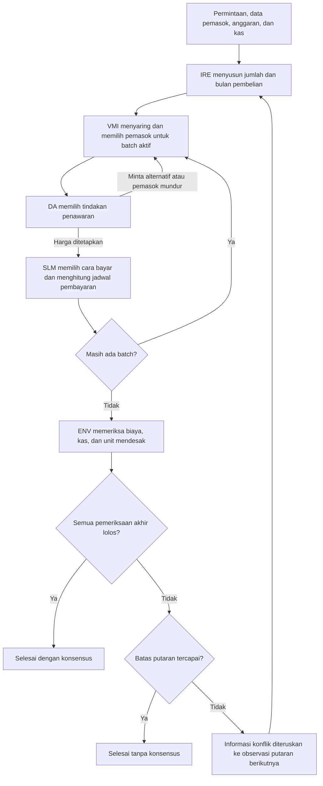

# MARL Procurement

Implementasi sederhana dari laporan "Penerapan Multi-Agent Reinforcement Learning (MARL) untuk Proses Pengadaan Barang Perusahaan secara Otonom" (Kelompok 2, Agen Cerdas Enterprise, Magister Kecerdasan Artifisial UGM, 2026).

Sistem dimodelkan sebagai Dec-POMDP dengan empat agen (IRE, VMI, DA, SLM) dan arsitektur CTDE. Semua algoritma ditulis sendiri (tanpa RLlib atau sejenisnya) supaya bisa dijelaskan saat presentasi.

Kode ini melakukan empat hal:

1. Mereproduksi angka perhitungan Bab 6 laporan (dibuktikan oleh unit test).
2. Menyediakan environment PettingZoo AEC berbasis giliran.
3. Melatih dan membandingkan lima kebijakan: random, rule-based, independent Q-learning (IQL), CTDE actor-critic, dan rencana optimal satu putaran.
4. Menampilkan hasilnya di dashboard Streamlit.

## Install

Proyek memakai Python 3.14 (versi yang dipakai dan diuji, dengan `venv`).

```bash
python3 -m venv .venv && source .venv/bin/activate
pip install -e .            # atau: pip install -r requirements.txt
```

Dengan `uv`: `uv sync`.

Semua perintah di bawah dijalankan dari root repositori (folder yang berisi `pyproject.toml`).

## Cara menjalankan

| Perintah | Fungsi |
|---|---|
| `pytest` | Semua test (54 test, sekitar 30 detik) |
| `python scripts/run_report_trace.py` | Cetak jejak rule-based pada skenario laporan, dalam bahasa Indonesia |
| `python scripts/check_scenarios.py 500` | Cek generator skenario acak: persen layak, rencana naif gagal, konsensus rule-based dan random |
| `python scripts/train.py --algo iql` | Latih IQL (50.000 episode, sekitar 2 menit) ke `runs/iql/` |
| `python scripts/train.py --algo ctde` | Latih CTDE (50.000 episode, sekitar 2,5 menit) ke `runs/ctde/` |
| `python scripts/evaluate.py` | Tabel perbandingan lima kebijakan ke `runs/comparison.csv` dan `.md` (pencarian rencana optimal pertama kali sekitar 2 menit, lalu di-cache) |
| `python scripts/sensitivity.py` | Latih ulang IQL dan CTDE untuk 4 nilai peluang penerimaan vendor (sekitar 20 menit) ke `runs/sensitivity/` |
| `streamlit run app/streamlit_app.py` | Dashboard |

Opsi training: `--episodes N`, `--seed S`, `--out DIR`, `--override P` (p_accept dan p_termin dibuat tetap).

Tiap training menyimpan `curve.csv` (kurva), `checkpoint.*`, dan `config.json`.

## Ringkasan hasil

Angka acuan Bab 6 (biaya, diskon, K1 = 10.203.000, K2 = -20.397.000, total 100.397.000, skor komposit 6,60 / 7,19 / 5,41, dan J(pi) = 150 / -10) semuanya cocok, dan rule-based pada fixture menghasilkan jejak laporan lalu berakhir tanpa konsensus setelah 6 putaran.

Perbandingan kebijakan pada 500 skenario acak (seed 0-499, kebijakan greedy):

| Kebijakan | Return tim | Konsensus | Pel. anggaran | Pel. kas | Unit mendesak | Putaran |
|---|---|---|---|---|---|---|
| Random | -0,09 | 77,0% | 17,8% | 3,2% | 90,2% | 2,87 |
| Rule-based | -1,08 | 64,0% | 14,2% | 9,8% | 84,0% | 2,88 |
| IQL | 1,19 | 79,6% | 18,6% | 2,4% | 99,4% | 2,17 |
| CTDE actor-critic | 1,71 | 80,4% | 19,2% | 0,4% | 100,0% | 2,04 |
| Rencana optimal satu putaran | 0,47 | 86,2% | 11,8% | 0,6% | 98,2% | 1,71 |

Tabel lengkap (biaya dan rasio) ada di `runs/comparison.md`. Untuk seed lain, return IQL 1,32 dan 1,15, CTDE 1,80 dan 1,74.

Cara membaca hasil:

- CTDE terbaik di antara kebijakan hasil latihan pada return, pelanggaran kas, dan pemenuhan unit mendesak. Tingkat konsensusnya hanya sedikit di atas IQL dan random.
- **Rasio terhadap rencana optimal satu putaran boleh > 1 dan bukan bukti kebijakan lebih baik.** Reward per agen diberikan di setiap putaran, sehingga episode gagal (6 putaran) mengumpulkan reward positif yang menutup sebagian penalti tim. Return episode gagal: CTDE -0,62, IQL -2,52, random -6,84. Rencana optimal menilai kegagalan berhenti di satu putaran. Tingkat konsensus lebih jujur: rencana optimal 86,2% dibanding CTDE 80,4%. Ini batasan desain reward yang diketahui.
- Rencana optimal satu putaran bukan batas atas. Ia hanya merencanakan satu putaran, sehingga kebijakan multi-putaran bisa melampauinya.
- Sensitivitas terhadap peluang penerimaan vendor (0,3 / 0,5 / 0,7 / 0,9): urutan kebijakan tidak berubah. CTDE tidak pernah memilih penawaran_balik, dan pemakaian penawaran_balik serta revisi_termin tidak naik seiring peluang. Kesimpulan tidak bergantung pada asumsi peluang, tetapi kedua aksi negosiasi hampir tidak memberi sinyal belajar (keuntungan penawaran balik hanya sekitar 0,6% harga).
- Hiperparameter tidak dituning, dan tiap konfigurasi hanya dilatih dengan satu sampai tiga seed.

## Pemetaan laporan ke kode

| Bagian laporan | Isi | File |
|---|---|---|
| 5.3 | Tiga aksi per agen | `env.py` (`IRE_ACTIONS`, `DA_ACTIONS`, `SLM_ACTIONS`, mask vendor) |
| 5.4.1 | Observasi diskret 4 variabel x 5 level | `env.py` (`discrete_obs`), `agents/iql.py` |
| 5.4.2 | Giliran, satu agen aktif per langkah | `env.py` (PettingZoo AEC) |
| 6.1 | Data skenario | `config/report_scenario.yaml`, `scenario.py` |
| 6.2 | Skor komposit vendor | `scenario.py` (`composite_scores`, `eligible_vendors`) |
| 6.3.1 | Vendor cadangan berbeda untuk batch kedua | `agents/rule_based.py` |
| 6.4 | Negosiasi DA dan diskon bayar cepat | `env.py` (`_step_da`, `_step_slm`), `costs.py` |
| 6.5 | Biaya, kas, dan jejak putaran koordinasi | `costs.py`, `scripts/run_report_trace.py`, `tests/test_rule_based_trace.py` |
| 6.6 | Objektif kolektif J(pi) | `rewards.py` (`collective_objective`) |
| Bab 5 (CTDE) | Actor lokal dan critic terpusat | `agents/ctde_ac.py` |

Bab 6 lain tidak punya kode: baseline klasifikasi dan NLP kontrak (lihat Future work).

## Struktur folder

```
config/        report_scenario.yaml (fixture), env_default.yaml (randomisasi, peluang, reward)
src/procurement_marl/
  scenario.py  costs.py  rewards.py  env.py  oracle.py  evaluate.py
  agents/      random_agent.py  rule_based.py  iql.py  ctde_ac.py
scripts/       train.py  evaluate.py  sensitivity.py  check_scenarios.py  run_report_trace.py
app/           streamlit_app.py
tests/         test_costs_report.py  test_env_api.py  test_rule_based_trace.py
               test_iql.py  test_ctde.py  test_dashboard.py
runs/          kurva training, checkpoint, tabel perbandingan, sensitivitas
DECISIONS.md   setiap interpretasi atas laporan dan asumsi kami
```

## Asumsi dan keputusan

Semua interpretasi atas laporan dan angka yang tidak ada di laporan (harga lantai A dan C, penawaran awal C, reputasi vendor hasil hitung balik, peluang penerimaan vendor, rentang skenario acak, desain reward) ada di [`DECISIONS.md`](DECISIONS.md), dan nilainya ada di file YAML dengan komentar asumsi. Nilai reputasi vendor perlu dikonfirmasi ke tim.

## Future work

- Baseline klasifikasi ML (Logistic Regression, SVM, Random Forest, XGBoost) dari awal Bab 6, karena tidak ada datanya.
- Pemahaman dokumen kontrak dan komunikasi antar-agen berbasis bahasa alami.
- Integrasi LLM untuk membaca permintaan teks bebas dan menjelaskan hasil episode (dibatalkan, tidak dikerjakan).
- Memperbaiki desain reward supaya episode gagal tidak bisa menutup penalti tim lewat reward per putaran, lalu mengulang training dan evaluasi.
- Rencana optimal multi-putaran yang benar-benar batas atas.

## Alur kerja antaragen

Sistem mempunyai empat agen pengambil keputusan: **IRE, VMI, DA, dan SLM**. **ENV adalah environment yang mengatur giliran dan memeriksa hasil**, bukan agen kelima yang memilih tindakan. Satu putaran mencakup penyusunan rencana oleh IRE, pemrosesan setiap batch oleh VMI–DA–SLM, lalu pemeriksaan keseluruhan oleh ENV.



Diagram menggambarkan alur implementasi saat ini. Status konsensus mengikuti pemeriksaan ENV yang tersedia; celah validasi pemasok dijelaskan pada bagian bug di bawah. Batas default adalah enam putaran, dengan pengaman tambahan 300 langkah.

### 1. IRE: menyusun rencana pembelian

IRE menentukan pembagian jumlah barang dan bulan pengadaan melalui tiga aksi:

| Aksi | Perilaku dalam kode saat ini |
|---|---|
| `teruskan` | Seluruh kebutuhan dibeli pada bulan 1. |
| `minta_klarifikasi` | Kebutuhan mendesak dibeli pada bulan 1; sisanya pada bulan 2. |
| `tunda` | Seluruh kebutuhan dipindahkan ke bulan 2, sehingga kebutuhan mendesak dapat dinyatakan terlambat. |

Nama `minta_klarifikasi` merupakan penyederhanaan: aksi ini langsung membagi pesanan, tanpa mengirim pertanyaan atau menunggu jawaban pengguna. Pada fixture laporan, pembagiannya adalah 700 unit pada bulan 1 dan 300 unit pada bulan 2. Implementasi: [`_step_ire`](src/procurement_marl/env.py).

### 2. VMI: menyaring dan memilih pemasok

VMI memilih pemasok untuk satu batch. Penyaringan mempertimbangkan kelulusan skor komposit, kapasitas, tenggat untuk batch bulan 1, dan pemasok yang sudah dikecualikan dalam batch tersebut. Estimasi biaya memakai harga terakhir yang disepakati dalam episode; jika belum ada, memakai harga list, ditambah transportasi dan risiko. Estimasi ini belum memasukkan diskon pembayaran cepat.

Pada fixture, skor A = 6,60, B = 7,19, dan C = 5,41, dengan ambang 6,00. Karena itu C gugur menurut aturan skor saat ini. Kapasitas C juga hanya 600 unit, sehingga tidak cukup untuk batch 700 atau 1.000 unit sekalipun ambang skor dilonggarkan. Fungsi terkait: [`composite_scores` dan `eligible_vendors`](src/procurement_marl/scenario.py), serta [`_vendor_mask` dan `_estimates`](src/procurement_marl/env.py).

### 3. DA: menetapkan harga dan meminta alternatif

| Aksi | Perilaku dalam kode saat ini |
|---|---|
| `penawaran_awal` | Mengambil harga penawaran awal pemasok. |
| `penawaran_balik` | Mencoba harga lantai. Jika ditolak, kembali ke harga awal dan relasi menurun. |
| `minta_alternatif` | Mengecualikan pemasok aktif dan mengembalikan giliran ke VMI jika ada alternatif. |

Penawaran balik dan permintaan alternatif masing-masing dibatasi sekali per batch. Pemasok dapat mundur setelah penolakan jika relasinya terlalu rendah dan masih ada pemasok pengganti. Harga yang akhirnya disepakati disimpan untuk estimasi putaran berikutnya. Implementasi: [`_step_da`](src/procurement_marl/env.py).

### 4. SLM: menentukan pembayaran dan menghitung biaya

| Aksi | Jadwal pembayaran barang | Diskon |
|---|---|---|
| `bayar_cepat` | Pada bulan batch | Menggunakan diskon pemasok jika tersedia |
| `bayar_jatuh_tempo` | Pada bulan berikutnya | Tidak ada |
| `revisi_termin` | Jika diterima: 50% bulan berikutnya dan 50% dua bulan setelah batch | Tidak ada |

Jika revisi termin ditolak, pembayaran beralih ke jatuh tempo. Biaya transportasi dan risiko selalu dibayar pada bulan batch. SLM mencatat biaya barang, diskon, biaya logistik, dan jadwal pembayaran. Rumus tersedia di [`costs.py`](src/procurement_marl/costs.py).

### 5. ENV: memeriksa hasil dan mengatur putaran berikutnya

Setelah seluruh batch diproses, ENV memeriksa kas negatif, kelebihan anggaran, pemenuhan unit mendesak, dan kas minimum jika diaktifkan sebagai batasan wajib. Pada fixture laporan, kas minimum hanya menghasilkan peringatan. ENV juga menghitung reward dan mencatat hasil ke log.

Jika pemeriksaan lolos, episode berakhir dengan konsensus. Jika gagal dan batas putaran belum tercapai, ENV memasukkan informasi konflik ke observasi dan memulai rencana baru. Batch serta komitmen pembayaran dihitung ulang untuk rencana tersebut; pembayaran dari percobaan sebelumnya tidak dijumlahkan sebagai transaksi aktual. Harga terakhir yang disepakati dan relasi pemasok tetap tersimpan selama episode. Implementasi: [`_end_round` dan `_start_round`](src/procurement_marl/env.py).

### Perbedaan alur environment dan kebijakan agen

Environment menyediakan pilihan tindakan, sedangkan kebijakan menentukan pilihan yang diambil. Kebijakan `Rule-based (meniru laporan)` sengaja menjalankan aturan tetap: IRE membagi pesanan setelah putaran pertama, VMI mengutamakan pemasok berbeda untuk batch berikutnya, DA selalu memilih penawaran awal, dan SLM selalu membayar cepat. Kebijakan ini tidak mencari penyesuaian baru berdasarkan jenis konflik.

Itulah penyebab putaran 3–6 pada ekspor fixture berulang dengan biaya Rp100.397.000, kelebihan anggaran Rp397.000, dan kas negatif. Pengulangan tersebut bahkan dipersyaratkan oleh [`test_rounds_3_to_6_repeat_and_end_without_consensus`](tests/test_rule_based_trace.py). Perilaku ini tidak boleh digeneralisasi sebagai perilaku seluruh kebijakan IQL atau CTDE. Random memilih aksi valid secara acak, sedangkan IQL dan CTDE memakai kebijakan hasil latihan.

## Bug dan rencana perbaikan

**Status: daftar berikut adalah hasil pemeriksaan dan rencana perubahan, belum merupakan perbaikan yang sudah diterapkan.** Bug yang berhasil direproduksi dibedakan dari keterbatasan desain, asumsi data, dan peningkatan penjelasan. Mode reproduksi laporan perlu tetap tersedia agar perubahan kebijakan tidak menghilangkan jejak acuan yang sudah diuji.

### 1. Prioritas tinggi: konsensus dapat lolos meskipun kapasitas pemasok tidak cukup

- **Status:** bug validasi terkonfirmasi melalui pengujian tambahan.
- **Penyebab:** ketika seluruh pemasok tersaring, `_mask("VMI")` membuka kembali semua pilihan dengan `[True] * 3`. Pemeriksaan akhir `_end_round` tidak memeriksa ulang kapasitas dan kelayakan skor pemasok.
- **Reproduksi:** gunakan fixture dengan kapasitas semua pemasok 100 unit dan kas awal Rp250 juta. Pilih `teruskan`, pemasok B, `penawaran_awal`, lalu `bayar_cepat`. Pesanan 1.000 unit dinyatakan konsensus tanpa pelanggaran meskipun kapasitas B hanya 100 unit.
- **Rencana:** tangani kondisi tanpa pemasok layak secara eksplisit; jangan membuka semua pilihan secara otomatis. Validasi batasan pemasok kembali sebelum menyatakan konsensus. Tinjau juga fallback `eligible_vendors` yang mempertahankan satu pemasok ketika semua skor di bawah ambang, agar aturan wajib dan pengecualiannya konsisten.
- **Kriteria selesai:** kasus kapasitas tidak cukup tidak menghasilkan konsensus; kondisi semua pemasok gugur selesai dengan alasan yang jelas tanpa loop atau kegagalan pemilihan aksi. Tambahkan tes regresi untuk kedua kondisi tersebut.

### 2. Prioritas menengah: putaran berulang tanpa perubahan rencana

- **Status:** keterbatasan desain kebijakan rule-based, bukan kesalahan reproduksi laporan. Informasi konflik sudah diteruskan oleh ENV, tetapi kebijakan ini tidak memakainya untuk mengubah strategi.
- **Rencana:** pertahankan baseline reproduksi laporan dan sediakan kebijakan adaptif terpisah yang menanggapi konflik dengan alternatif pemasok, negosiasi, atau pembayaran yang relevan. Tambahkan penghentian dengan alasan `tidak ada perbaikan` ketika rencana dan keadaan yang relevan tidak berubah.
- **Kriteria selesai:** pengulangan deterministik tidak menghabiskan putaran tanpa penjelasan. Untuk kebijakan stokastik, keputusan berhenti juga mempertimbangkan perubahan harga, relasi, dan peluang hasil berikutnya; tindakan sama belum tentu berarti keadaan sama.

### 3. Prioritas menengah: label klarifikasi tidak sesuai proses yang dilakukan

- **Status:** masalah penamaan dan penyederhanaan model. `minta_klarifikasi` saat ini hanya membagi kebutuhan mendesak dan nonmendesak.
- **Rencana:** perjelas label tampilan sebagai pembagian atau revisi kebutuhan. Jika klarifikasi sungguhan diperlukan, tambahkan keadaan menunggu informasi dan jawaban yang benar-benar memengaruhi rencana. Pertahankan pemetaan aksi dan kompatibilitas checkpoint saat mengubah label.
- **Kriteria selesai:** dashboard dan ekspor menjelaskan tindakan yang benar-benar terjadi; tidak mengesankan ada percakapan klarifikasi yang belum diimplementasikan.

### 4. Prioritas menengah: ketidaklayakan kas belum dijelaskan sejak awal

- **Status:** keterbatasan diagnosis skenario, bukan kesalahan aritmetika biaya.
- **Bukti fixture:** kas awal Rp150 juta dikurangi kebutuhan lain Rp70 juta menyisakan Rp80 juta, tanpa pemasukan selama empat bulan. Biaya terendah secara optimistis untuk 1.000 unit adalah Rp99.220.000, memakai harga lantai B dan diskon cepat. Seluruh opsi pembayaran dalam model jatuh dalam horizon empat bulan, sehingga masih ada kekurangan sedikitnya Rp19.220.000. Memasukkan C atau menggeser pembayaran saja tidak mengatasi kekurangan total tersebut.
- **Rencana:** tambahkan pemeriksaan awal yang dapat membuktikan ketidaklayakan dari batas bawah biaya dan kas, beserta penjelasan kebutuhan perubahan pendanaan, jumlah, atau batasan. Untuk kasus yang belum dapat dibuktikan, gunakan status `belum ditemukan solusi`, bukan langsung `tidak mungkin`.
- **Kriteria selesai:** fixture menampilkan alasan kekurangan kas dengan angka yang dapat ditelusuri. Simulasi reproduksi tetap dapat dijalankan untuk kebutuhan demonstrasi.

### 5. Tinjauan aturan: penyaringan pemasok C dan dasar skor komposit

- **Status:** C gugur sesuai aturan 5,41 < 6,00; belum ditemukan bug perhitungan skor pada fixture. Namun, nilai reputasi dihitung balik agar cocok dengan skor laporan, sebagaimana dicatat di `DECISIONS.md`.
- **Rencana:** validasi sumber reputasi, bobot, dan ambang. Bedakan syarat wajib dari preferensi peringkat: kandidat tidak boleh diloloskan hanya agar hasil menjadi sukses. Tampilkan komponen skor dan alasan penolakan; jika ada beberapa pelanggaran, tampilkan semuanya, bukan hanya alasan pertama yang diperiksa.
- **Kriteria selesai:** pengecualian C dapat dijelaskan dari data yang disepakati. Perubahan ambang atau aturan diuji terhadap kapasitas, tenggat, biaya, dan kas, bukan hanya jumlah pemasok yang lolos.

### 6. Tinjauan model: reward berulang dapat mengaburkan kegagalan

- **Status:** keterbatasan desain yang sudah didokumentasikan pada bagian hasil dan `DECISIONS.md`, bukan temuan bahwa kebijakan rule-based belajar mengeksploitasi reward.
- **Rencana:** evaluasi desain reward yang tidak memberi keuntungan dari pengulangan tanpa kemajuan, serta samakan dasar perbandingan horizon dengan rencana satu putaran. Jika desain diubah, lakukan pelatihan dan evaluasi ulang, lalu bedakan hasil baru dari checkpoint dan hasil lama.
- **Kriteria selesai:** perbandingan melaporkan konsensus, pelanggaran, dan biaya selain return. Return yang lebih tinggi pada episode gagal tidak ditafsirkan sebagai solusi pengadaan yang lebih baik.

### Hasil pemeriksaan sebelum perbaikan

Pada pemeriksaan ini, 23 tes terkait biaya, skor, jejak rule-based, ketidaklayakan fixture, dan permintaan alternatif lulus. Jejak 45 baris hasil eksekusi beserta format dashboard cocok persis dengan ekspor CSV yang diperiksa. Pengujian tambahan skenario kapasitas 100 unit membuktikan bug pada butir 1, yang belum dicakup tes tersebut. Kelulusan tes reproduksi tidak berarti seluruh batasan bisnis sudah tervalidasi.

## Alur kerja antaragen

Sistem mempunyai empat agen pengambil keputusan: **IRE, VMI, DA, dan SLM**. **ENV adalah environment yang mengatur giliran dan memeriksa hasil**, bukan agen kelima yang memilih tindakan. Satu putaran mencakup penyusunan rencana oleh IRE, pemrosesan setiap batch oleh VMI–DA–SLM, lalu pemeriksaan keseluruhan oleh ENV.


Diagram menggambarkan alur implementasi saat ini. Status konsensus mengikuti pemeriksaan ENV yang tersedia; celah validasi pemasok dijelaskan pada bagian bug di bawah. Batas default adalah enam putaran, dengan pengaman tambahan 300 langkah.

### 1. IRE: menyusun rencana pembelian

IRE menentukan pembagian jumlah barang dan bulan pengadaan melalui tiga aksi:

| Aksi | Perilaku dalam kode saat ini |
|---|---|
| `teruskan` | Seluruh kebutuhan dibeli pada bulan 1. |
| `minta_klarifikasi` | Kebutuhan mendesak dibeli pada bulan 1; sisanya pada bulan 2. |
| `tunda` | Seluruh kebutuhan dipindahkan ke bulan 2, sehingga kebutuhan mendesak dapat dinyatakan terlambat. |

Nama `minta_klarifikasi` merupakan penyederhanaan: aksi ini langsung membagi pesanan, tanpa mengirim pertanyaan atau menunggu jawaban pengguna. Pada fixture laporan, pembagiannya adalah 700 unit pada bulan 1 dan 300 unit pada bulan 2. Implementasi: [`_step_ire`](src/procurement_marl/env.py).

### 2. VMI: menyaring dan memilih pemasok

VMI memilih pemasok untuk satu batch. Penyaringan mempertimbangkan kelulusan skor komposit, kapasitas, tenggat untuk batch bulan 1, dan pemasok yang sudah dikecualikan dalam batch tersebut. Estimasi biaya memakai harga terakhir yang disepakati dalam episode; jika belum ada, memakai harga list, ditambah transportasi dan risiko. Estimasi ini belum memasukkan diskon pembayaran cepat.

Pada fixture, skor A = 6,60, B = 7,19, dan C = 5,41, dengan ambang 6,00. Karena itu C gugur menurut aturan skor saat ini. Kapasitas C juga hanya 600 unit, sehingga tidak cukup untuk batch 700 atau 1.000 unit sekalipun ambang skor dilonggarkan. Fungsi terkait: [`composite_scores` dan `eligible_vendors`](src/procurement_marl/scenario.py), serta [`_vendor_mask` dan `_estimates`](src/procurement_marl/env.py).

### 3. DA: menetapkan harga dan meminta alternatif

| Aksi | Perilaku dalam kode saat ini |
|---|---|
| `penawaran_awal` | Mengambil harga penawaran awal pemasok. |
| `penawaran_balik` | Mencoba harga lantai. Jika ditolak, kembali ke harga awal dan relasi menurun. |
| `minta_alternatif` | Mengecualikan pemasok aktif dan mengembalikan giliran ke VMI jika ada alternatif. |

Penawaran balik dan permintaan alternatif masing-masing dibatasi sekali per batch. Pemasok dapat mundur setelah penolakan jika relasinya terlalu rendah dan masih ada pemasok pengganti. Harga yang akhirnya disepakati disimpan untuk estimasi putaran berikutnya. Implementasi: [`_step_da`](src/procurement_marl/env.py).

### 4. SLM: menentukan pembayaran dan menghitung biaya

| Aksi | Jadwal pembayaran barang | Diskon |
|---|---|---|
| `bayar_cepat` | Pada bulan batch | Menggunakan diskon pemasok jika tersedia |
| `bayar_jatuh_tempo` | Pada bulan berikutnya | Tidak ada |
| `revisi_termin` | Jika diterima: 50% bulan berikutnya dan 50% dua bulan setelah batch | Tidak ada |

Jika revisi termin ditolak, pembayaran beralih ke jatuh tempo. Biaya transportasi dan risiko selalu dibayar pada bulan batch. SLM mencatat biaya barang, diskon, biaya logistik, dan jadwal pembayaran. Rumus tersedia di [`costs.py`](src/procurement_marl/costs.py).

### 5. ENV: memeriksa hasil dan mengatur putaran berikutnya

Setelah seluruh batch diproses, ENV memeriksa kas negatif, kelebihan anggaran, pemenuhan unit mendesak, dan kas minimum jika diaktifkan sebagai batasan wajib. Pada fixture laporan, kas minimum hanya menghasilkan peringatan. ENV juga menghitung reward dan mencatat hasil ke log.

Jika pemeriksaan lolos, episode berakhir dengan konsensus. Jika gagal dan batas putaran belum tercapai, ENV memasukkan informasi konflik ke observasi dan memulai rencana baru. Batch serta komitmen pembayaran dihitung ulang untuk rencana tersebut; pembayaran dari percobaan sebelumnya tidak dijumlahkan sebagai transaksi aktual. Harga terakhir yang disepakati dan relasi pemasok tetap tersimpan selama episode. Implementasi: [`_end_round` dan `_start_round`](src/procurement_marl/env.py).