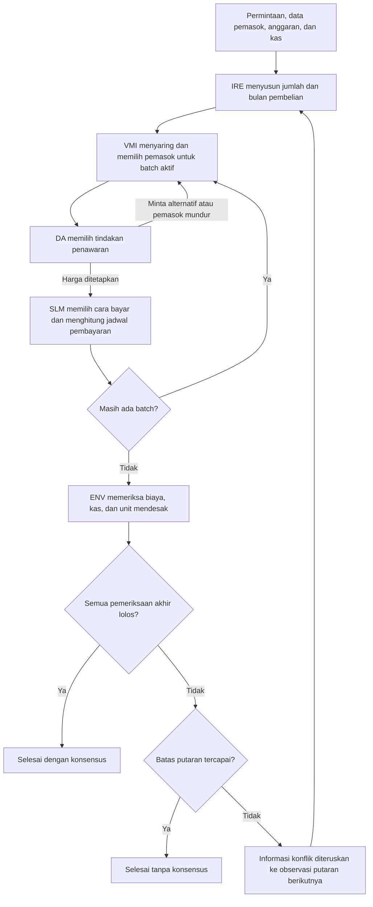

# MARL Procurement

Implementasi sederhana dari laporan "Penerapan Multi-Agent Reinforcement Learning (MARL) untuk Proses Pengadaan Barang Perusahaan secara Otonom" (Kelompok 2, Agen Cerdas Enterprise, Magister Kecerdasan Artifisial UGM, 2026).

Sistem dimodelkan sebagai Dec-POMDP dengan empat agen (IRE, VMI, DA, SLM) dan arsitektur CTDE. Semua algoritma ditulis sendiri (tanpa RLlib atau sejenisnya) supaya bisa dijelaskan saat presentasi.

Kode ini melakukan empat hal:

1. Mereproduksi angka perhitungan Bab 6 laporan (dibuktikan oleh unit test).
2. Menyediakan environment PettingZoo AEC berbasis giliran.
3. Melatih dan membandingkan lima kebijakan: random, rule-based, independent Q-learning (IQL), CTDE actor-critic, dan rencana optimal satu putaran.
4. Menampilkan hasilnya di dashboard Streamlit.

## Install

Proyek memakai Python 3.14 (versi yang dipakai dan diuji, dengan `venv`).

```bash
python3 -m venv .venv && source .venv/bin/activate
pip install -e .            # atau: pip install -r requirements.txt
```

Dengan `uv`: `uv sync`.

Semua perintah di bawah dijalankan dari root repositori (folder yang berisi `pyproject.toml`).

## Cara menjalankan

| Perintah | Fungsi |
|---|---|
| `pytest` | Semua test (62 test, sekitar 30 detik) |
| `python scripts/run_report_trace.py` | Cetak jejak rule-based pada skenario laporan, dalam bahasa Indonesia |
| `python scripts/check_scenarios.py 500` | Cek generator skenario acak: persen layak, rencana naif gagal, konsensus rule-based dan random |
| `python scripts/train.py --algo iql` | Latih IQL (50.000 episode, sekitar 2 menit) ke `runs/iql/` |
| `python scripts/train.py --algo ctde` | Latih CTDE (50.000 episode, sekitar 2,5 menit) ke `runs/ctde/` |
| `python scripts/evaluate.py` | Tabel perbandingan lima kebijakan ke `runs/comparison.csv` dan `.md` (pencarian rencana optimal pertama kali sekitar 2 menit, lalu di-cache) |
| `python scripts/sensitivity.py` | Latih ulang IQL dan CTDE untuk 4 nilai peluang penerimaan vendor (sekitar 20 menit) ke `runs/sensitivity/` |
| `streamlit run app/streamlit_app.py` | Dashboard |

Opsi training: `--episodes N`, `--seed S`, `--out DIR`, `--override P` (p_accept dan p_termin dibuat tetap).

Tiap training menyimpan `curve.csv` (kurva), `checkpoint.*`, dan `config.json`.

## Ringkasan hasil

Angka acuan Bab 6 (biaya, diskon, K1 = 10.203.000, K2 = -20.397.000, total 100.397.000, skor komposit 6,60 / 7,19 / 5,41, dan J(pi) = 150 / -10) semuanya cocok, dan rule-based pada fixture menghasilkan jejak laporan lalu berakhir tanpa konsensus setelah 6 putaran.

Perbandingan kebijakan pada 500 skenario acak (seed 0-499, kebijakan greedy):

| Kebijakan | Return tim | Konsensus | Pel. anggaran | Pel. kas | Unit mendesak | Putaran |
|---|---|---|---|---|---|---|
| Random | -0,18 | 78,2% | 7,8% | 1,8% | 85,2% | 2,76 |
| Rule-based | 0,11 | 76,2% | 6,6% | 7,8% | 89,2% | 2,45 |
| IQL | 1,06 | 81,0% | 8,2% | 1,0% | 89,2% | 2,48 |
| CTDE actor-critic | 1,93 | 78,0% | 11,6% | 1,0% | 89,2% | 2,92 |
| Rencana optimal satu putaran | 0,44 | 84,6% | 5,0% | 0,4% | 89,2% | 1,79 |

Tabel lengkap (biaya dan rasio) ada di `runs/comparison.md`. Angka ini dari satu seed training (seed 0) setelah perbaikan validasi pemasok (kapasitas, skor sebagai syarat wajib) dan penyetelan ulang rentang skenario. Hasil sebelum perbaikan disimpan di `runs_before_capacity_fix/` dan `runs_before_score_filter_fix/`. Unit mendesak terpenuhi 89,2% untuk rencana optimal, IQL, dan CTDE karena sekitar 11% skenario acak memang tidak punya pemasok yang bisa mengirim unit mendesak tepat waktu.

Cara membaca hasil:

- **Tiga seed training** (0, 1, 2, dievaluasi pada 500 skenario yang sama; seed 1 dan 2 di `runs/seeds/`): return IQL 1,06 / 1,39 / 1,01 (rata-rata 1,15) dan CTDE 1,93 / 2,23 / 0,81 (rata-rata 1,66). Konsensus IQL 81,0 / 81,2 / 77,8% (rata-rata 80,0%) dan CTDE 78,0 / 78,0 / 82,2% (rata-rata 79,4%). Rentang antar seed (sekitar 1,4 poin return CTDE, 4 poin konsensus) sama besar dengan selisih antar kebijakan, jadi perbedaan IQL dan CTDE tidak bisa dianggap nyata. Yang konsisten hanya: keduanya di atas rule-based pada return, dan di bawah rencana optimal satu putaran (84,6%) pada konsensus.
- Kebijakan hasil latihan hanya sedikit lebih baik dari baseline pada konsensus: IQL 81,0%, CTDE 78,0%, random 78,2%, rule-based 76,2%. CTDE punya return tertinggi (1,93) tetapi konsensusnya tidak lebih tinggi dari random dan pelanggaran anggarannya paling banyak (11,6%). CTDE unggul pada pelanggaran kas (1,0% dibanding 7,8% rule-based). Setelah validasi diperketat, tidak ada bukti jelas bahwa CTDE lebih baik dari IQL.
- **Rasio terhadap rencana optimal satu putaran boleh > 1 dan bukan bukti kebijakan lebih baik.** Reward per agen diberikan di setiap putaran, sehingga return episode gagal (6 putaran) tidak sebanding dengan rencana optimal yang berhenti di putaran 1. Rata-rata return episode yang gagal: CTDE -4,95, IQL -6,64, random -8,75, rule-based -7,03. Tingkat konsensus lebih jujur: rencana optimal 84,6% dibanding IQL 81,0% dan CTDE 78,0%. Ini batasan desain reward yang diketahui.
- Rencana optimal satu putaran bukan batas atas. Ia hanya merencanakan satu putaran, sehingga kebijakan multi-putaran bisa melampauinya.
- Sensitivitas terhadap peluang penerimaan vendor (0,3 / 0,5 / 0,7 / 0,9, `runs/sensitivity/summary.csv`): return CTDE 0,84 / 2,14 / 2,11 / 2,36 dan IQL 1,03 / 1,42 / 0,94 / 1,54. CTDE tidak selalu di atas IQL (pada 0,3 dan 0,7 justru di bawah atau sejajar), jadi urutan kedua kebijakan tidak stabil terhadap asumsi peluang. Konsensus semua kebijakan berada di 78% sampai 80,4%, hampir sama dengan random (78,4% sampai 78,6%). CTDE hampir tidak memakai penawaran_balik (0% sampai 0,4%) dan memilih revisi_termin 73% sampai 100%; IQL memakai penawaran_balik 34% sampai 56% tanpa pola terhadap peluang. Kesimpulan: hasil latihan lemah dan peka terhadap seed dan asumsi; kedua aksi negosiasi hampir tidak memberi sinyal belajar (keuntungan penawaran balik hanya sekitar 0,6% harga).
- Hiperparameter tidak dituning. Perbandingan utama memakai tiga seed training; sensitivitas hanya satu seed.

## Pemetaan laporan ke kode

| Bagian laporan | Isi | File |
|---|---|---|
| 5.3 | Tiga aksi per agen | `env.py` (`IRE_ACTIONS`, `DA_ACTIONS`, `SLM_ACTIONS`, mask vendor) |
| 5.4.1 | Observasi diskret 4 variabel x 5 level | `env.py` (`discrete_obs`), `agents/iql.py` |
| 5.4.2 | Giliran, satu agen aktif per langkah | `env.py` (PettingZoo AEC) |
| 6.1 | Data skenario | `config/report_scenario.yaml`, `scenario.py` |
| 6.2 | Skor komposit vendor | `scenario.py` (`composite_scores`, `eligible_vendors`) |
| 6.3.1 | Vendor cadangan berbeda untuk batch kedua | `agents/rule_based.py` |
| 6.4 | Negosiasi DA dan diskon bayar cepat | `env.py` (`_step_da`, `_step_slm`), `costs.py` |
| 6.5 | Biaya, kas, dan jejak putaran koordinasi | `costs.py`, `scripts/run_report_trace.py`, `tests/test_rule_based_trace.py` |
| 6.6 | Objektif kolektif J(pi) | `rewards.py` (`collective_objective`) |
| Bab 5 (CTDE) | Actor lokal dan critic terpusat | `agents/ctde_ac.py` |

Bab 6 lain tidak punya kode: baseline klasifikasi dan NLP kontrak (lihat Future work).

## Struktur folder

```
config/        report_scenario.yaml (fixture), env_default.yaml (randomisasi, peluang, reward)
src/procurement_marl/
  scenario.py  costs.py  rewards.py  env.py  oracle.py  evaluate.py
  agents/      random_agent.py  rule_based.py  iql.py  ctde_ac.py
scripts/       train.py  evaluate.py  sensitivity.py  check_scenarios.py  run_report_trace.py
app/           streamlit_app.py
tests/         test_costs_report.py  test_env_api.py  test_rule_based_trace.py
               test_iql.py  test_ctde.py  test_dashboard.py
runs/          kurva training, checkpoint, tabel perbandingan, sensitivitas
DECISIONS.md   setiap interpretasi atas laporan dan asumsi kami
```

## Asumsi dan keputusan

Semua interpretasi atas laporan dan angka yang tidak ada di laporan (harga lantai A dan C, penawaran awal C, reputasi vendor hasil hitung balik, peluang penerimaan vendor, rentang skenario acak, desain reward) ada di [`DECISIONS.md`](DECISIONS.md), dan nilainya ada di file YAML dengan komentar asumsi. Nilai reputasi vendor perlu dikonfirmasi ke tim.

## Future work

- Baseline klasifikasi ML (Logistic Regression, SVM, Random Forest, XGBoost) dari awal Bab 6, karena tidak ada datanya.
- Pemahaman dokumen kontrak dan komunikasi antar-agen berbasis bahasa alami.
- Integrasi LLM untuk membaca permintaan teks bebas dan menjelaskan hasil episode (dibatalkan, tidak dikerjakan).
- Memperbaiki desain reward supaya episode gagal tidak bisa menutup penalti tim lewat reward per putaran, lalu mengulang training dan evaluasi.
- Rencana optimal multi-putaran yang benar-benar batas atas.

## Alur kerja antaragen

Sistem mempunyai empat agen pengambil keputusan: **IRE, VMI, DA, dan SLM**. **ENV adalah environment yang mengatur giliran dan memeriksa hasil**, bukan agen kelima yang memilih tindakan. Satu putaran mencakup penyusunan rencana oleh IRE, pemrosesan setiap batch oleh VMI–DA–SLM, lalu pemeriksaan keseluruhan oleh ENV.



Diagram menggambarkan alur implementasi saat ini. Status konsensus mengikuti pemeriksaan ENV (biaya, kas, unit mendesak, dan kelayakan pemasok). Batas default adalah enam putaran, dengan pengaman tambahan 300 langkah.

### 1. IRE: menyusun rencana pembelian

IRE menentukan pembagian jumlah barang dan bulan pengadaan melalui tiga aksi:

| Aksi | Perilaku dalam kode saat ini |
|---|---|
| `teruskan` | Seluruh kebutuhan dibeli pada bulan 1. |
| `minta_klarifikasi` | Kebutuhan mendesak dibeli pada bulan 1; sisanya pada bulan 2. |
| `tunda` | Seluruh kebutuhan dipindahkan ke bulan 2, sehingga kebutuhan mendesak dapat dinyatakan terlambat. |

Nama `minta_klarifikasi` merupakan penyederhanaan: aksi ini langsung membagi pesanan, tanpa mengirim pertanyaan atau menunggu jawaban pengguna. Pada fixture laporan, pembagiannya adalah 700 unit pada bulan 1 dan 300 unit pada bulan 2. Implementasi: [`_step_ire`](src/procurement_marl/env.py).

### 2. VMI: menyaring dan memilih pemasok

VMI memilih pemasok untuk satu batch. Penyaringan mempertimbangkan kelulusan skor komposit, kapasitas, tenggat untuk batch bulan 1, dan pemasok yang sudah dikecualikan dalam batch tersebut. Estimasi biaya memakai harga terakhir yang disepakati dalam episode; jika belum ada, memakai harga list, ditambah transportasi dan risiko. Estimasi ini belum memasukkan diskon pembayaran cepat.

Pada fixture, skor A = 6,60, B = 7,19, dan C = 5,41, dengan ambang 6,00. Karena itu C gugur menurut aturan skor saat ini. Kapasitas C juga hanya 600 unit, sehingga tidak cukup untuk batch 700 atau 1.000 unit sekalipun ambang skor dilonggarkan. Fungsi terkait: [`composite_scores` dan `eligible_vendors`](src/procurement_marl/scenario.py), serta [`_vendor_mask` dan `_estimates`](src/procurement_marl/env.py).

### 3. DA: menetapkan harga dan meminta alternatif

| Aksi | Perilaku dalam kode saat ini |
|---|---|
| `penawaran_awal` | Mengambil harga penawaran awal pemasok. |
| `penawaran_balik` | Mencoba harga lantai. Jika ditolak, kembali ke harga awal dan relasi menurun. |
| `minta_alternatif` | Mengecualikan pemasok aktif dan mengembalikan giliran ke VMI jika ada alternatif. |

Penawaran balik dan permintaan alternatif masing-masing dibatasi sekali per batch. Pemasok dapat mundur setelah penolakan jika relasinya terlalu rendah dan masih ada pemasok pengganti. Harga yang akhirnya disepakati disimpan untuk estimasi putaran berikutnya. Implementasi: [`_step_da`](src/procurement_marl/env.py).

### 4. SLM: menentukan pembayaran dan menghitung biaya

| Aksi | Jadwal pembayaran barang | Diskon |
|---|---|---|
| `bayar_cepat` | Pada bulan batch | Menggunakan diskon pemasok jika tersedia |
| `bayar_jatuh_tempo` | Pada bulan berikutnya | Tidak ada |
| `revisi_termin` | Jika diterima: 50% bulan berikutnya dan 50% dua bulan setelah batch | Tidak ada |

Jika revisi termin ditolak, pembayaran beralih ke jatuh tempo. Biaya transportasi dan risiko selalu dibayar pada bulan batch. SLM mencatat biaya barang, diskon, biaya logistik, dan jadwal pembayaran. Rumus tersedia di [`costs.py`](src/procurement_marl/costs.py).

### 5. ENV: memeriksa hasil dan mengatur putaran berikutnya

Setelah seluruh batch diproses, ENV memeriksa kas negatif, kelebihan anggaran, pemenuhan unit mendesak, kapasitas pemasok terpilih (termasuk kasus tidak ada pemasok yang cocok), dan kas minimum jika diaktifkan sebagai batasan wajib. Pada fixture laporan, kas minimum hanya menghasilkan peringatan. ENV juga menghitung reward dan mencatat hasil ke log.

Jika pemeriksaan lolos, episode berakhir dengan konsensus. Jika gagal dan batas putaran belum tercapai, ENV memasukkan informasi konflik ke observasi dan memulai rencana baru. Batch serta komitmen pembayaran dihitung ulang untuk rencana tersebut; pembayaran dari percobaan sebelumnya tidak dijumlahkan sebagai transaksi aktual. Harga terakhir yang disepakati dan relasi pemasok tetap tersimpan selama episode. Implementasi: [`_end_round` dan `_start_round`](src/procurement_marl/env.py).

### Perbedaan alur environment dan kebijakan agen

Environment menyediakan pilihan tindakan, sedangkan kebijakan menentukan pilihan yang diambil. Kebijakan `Rule-based (meniru laporan)` sengaja menjalankan aturan tetap: IRE membagi pesanan setelah putaran pertama, VMI mengutamakan pemasok berbeda untuk batch berikutnya, DA selalu memilih penawaran awal, dan SLM selalu membayar cepat. Kebijakan ini tidak mencari penyesuaian baru berdasarkan jenis konflik.

Itulah penyebab putaran 3–6 pada ekspor fixture berulang dengan biaya Rp100.397.000, kelebihan anggaran Rp397.000, dan kas negatif. Pengulangan tersebut bahkan dipersyaratkan oleh [`test_rounds_3_to_6_repeat_and_end_without_consensus`](tests/test_rule_based_trace.py). Perilaku ini tidak boleh digeneralisasi sebagai perilaku seluruh kebijakan IQL atau CTDE. Random memilih aksi valid secara acak, sedangkan IQL dan CTDE memakai kebijakan hasil latihan.
